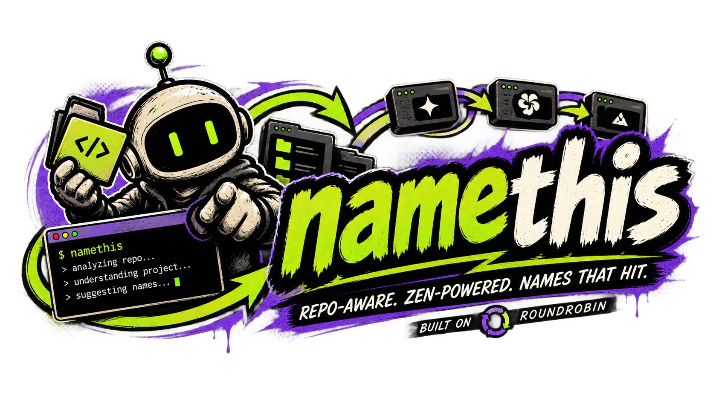

# namethis

<p align="center">
  
</p>

<p align="center">
  <a href="https://www.npmjs.com/package/@genoventures-labs/namethis"></a>
  <a href="https://www.npmjs.com/package/@genoventures-labs/namethis"></a>
  <a href="https://github.com/bobbybacklogs/namethis/blob/main/LICENSE"></a>
  <a href="https://nodejs.org/"></a>
</p>

`namethis` is a lightweight, repo-aware naming tool that looks at the project in your current directory, figures out what you’re building, and suggests 2–3 strong names with a short rationale for each.

It uses [ModelHitch](https://github.com/bobbybacklogs/ModelHitch) for provider routing, failover, and BYOK credentials (`~/.modelhitch/config.json` policy or `autoMode`).

---

## Highlights

- **Repo-Aware Context**: Automatically analyzes project structure, file signatures, manifests, and documentation.
- **Deep Crawl Mode**: Optional `--crawl` walks the tree with bounded depth, file count, and excerpt size for richer naming context.
- **Grounded Suggestions**: Curates 2–3 strong, realistic name options (avoiding generic AI buzzwords or cliché patterns).
- **ModelHitch Routing**: Uses ModelHitch policy or `autoMode` for provider/model selection and failover — no custom env scanning or fallback lanes in namethis.
- **Clean CLI Experience**: Monospace, distraction-free terminal formatting with zero emojis.
- **Dual Support**: Use directly from your terminal with `npx` or import programmatically in TypeScript / JavaScript.

---

## Quick Start

### Run instantly with `npx`

```bash
npx @genoventures-labs/namethis
```

### Install globally

```bash
npm install -g @genoventures-labs/namethis
```

### Add to a project

```bash
npm install @genoventures-labs/namethis
```

### Credentials

Set one of these for live Gateway calls (preferred):

```bash
export AI_GATEWAY_API_KEY=…   # from https://vercel.com/ai-gateway
# or: export VERCEL_OIDC_TOKEN=…
# or pass the same key with: namethis --key "$AI_GATEWAY_API_KEY"
```

Optional ModelHitch config (same as other ModelHitch tools):

```bash
# ~/.modelhitch/config.json — policy, keys, default provider/model
```

---

## Usage

Run `namethis` inside any project directory:

```bash
namethis
```

Or target a specific directory:

```bash
namethis ./path/to/project
```

### Common Options

| Option | Description |
|---|---|
| `-c, --count <n>` | Number of name candidates (default: 3) |
| `--context <text>` | Extra background, audience, or product nuances |
| `-k, --key <api-key>` | AI Gateway API key (`AI_GATEWAY_API_KEY`) |
| `-p, --provider <id>` | Override ModelHitch provider (otherwise uses ModelHitch routing policy) |
| `-m, --model <id>` | Model override (e.g. `openai/gpt-5.4`) |
| `--inspect` | Preview scanned files and metadata without querying models |
| `--crawl` | Deep-crawl the directory tree for richer naming context (bounded depth, file count, and size) |
| `--json` | Return output in raw JSON format |
| `-h, --help` | Show full help menu |

### Examples

**Add positioning context:**
```bash
namethis --context "High-throughput database migration runner for PostgreSQL"
```

**Generate 5 candidate options:**
```bash
namethis -c 5
```

**Inspect parsed repo context:**
```bash
namethis --inspect
```

**Deep-crawl for richer context (large or nested repos):**
```bash
namethis --crawl
namethis ./path/to/project --crawl --inspect
```

**List providers / models:**
```bash
namethis models
```

---

## Programmatic API

```typescript
import { generateNames } from '@genoventures-labs/namethis';

const result = await generateNames({
  cwd: './my-app',
  count: 3,
  crawl: true, // optional: deep-crawl for richer context
});

for (const item of result.suggestions) {
  console.log(`${item.name}: ${item.rationale}`);
}
```

---

## Changelog

See [CHANGELOG.md](CHANGELOG.md). Current release: **0.3.1**.

---

## License

[MIT](LICENSE)
